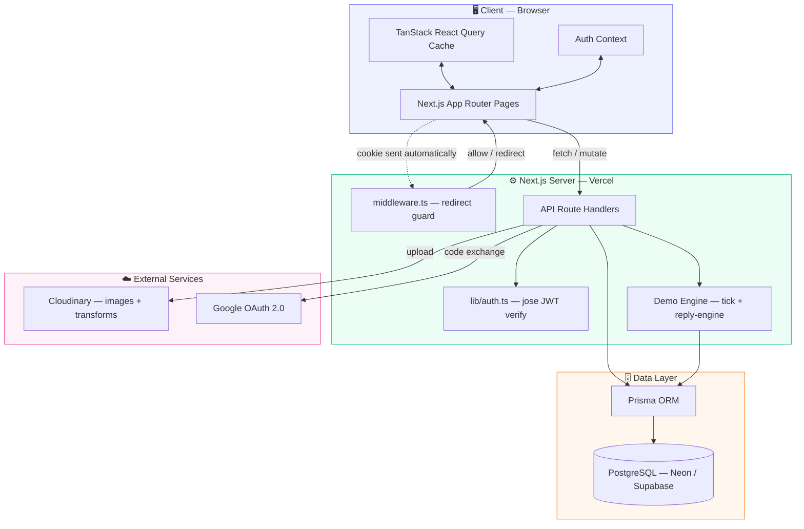
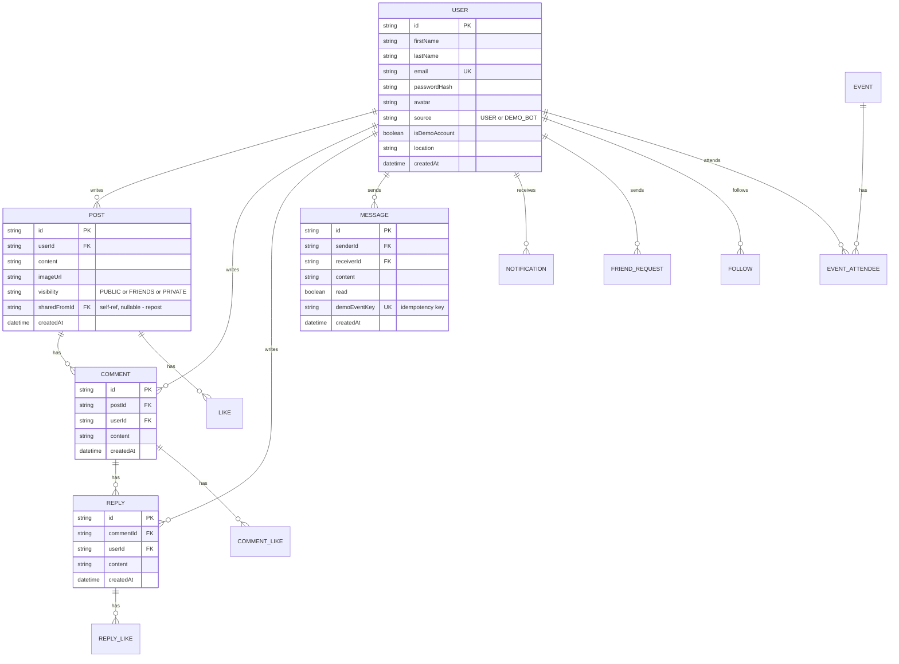
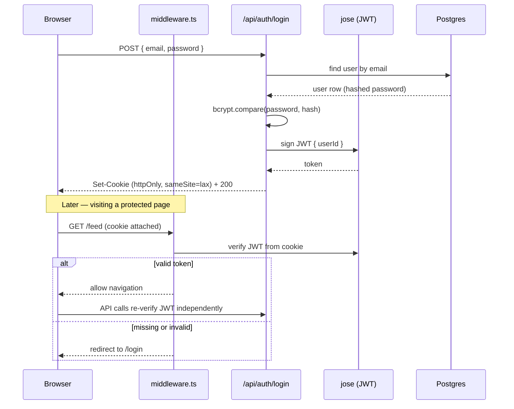
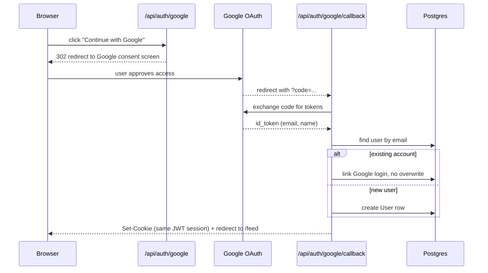
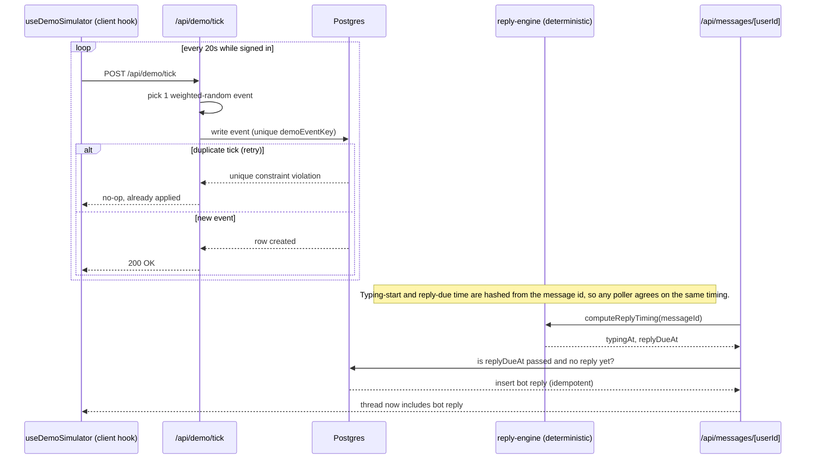
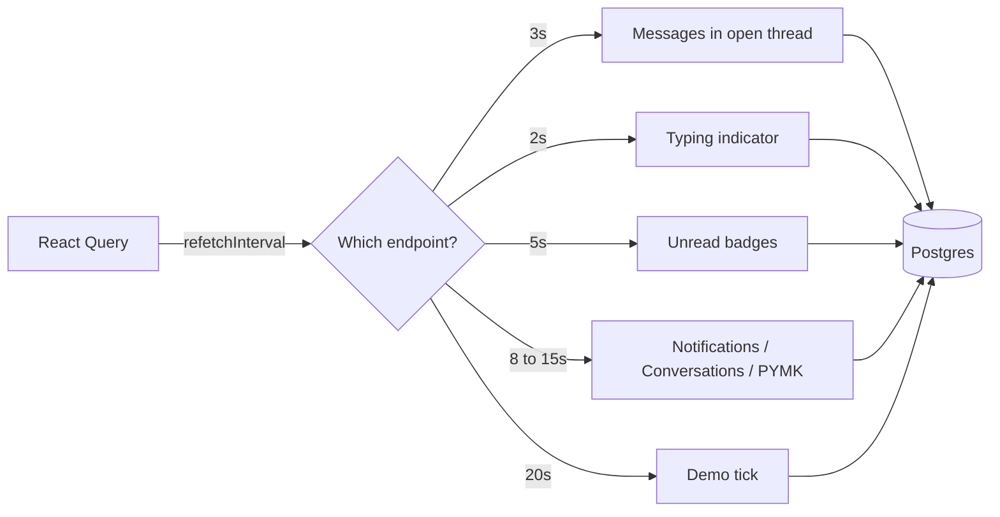

<p align="center">
  
</p>

<p align="center">
  <a href="https://buddy-script-lovat.vercel.app/">
    
  </a>
</p>

<p align="center">
  <a href="https://buddy-script-lovat.vercel.app/"></a>
  
  
  
  
</p>

<blockquote>
💡 <strong>A note on the "animated" elements above:</strong> GitHub strips <code>&lt;style&gt;</code>/<code>&lt;script&gt;</code> tags from rendered Markdown for security, so hand-written <code>@keyframes</code> CSS won't actually run in a README. The banner and the typing line above are SVGs generated on the fly by <a href="https://github.com/kyechan99/capsule-render">capsule-render</a> and <a href="https://github.com/DenverCoder1/readme-typing-svg">readme-typing-svg</a> — GitHub just displays them as <code>&lt;img&gt;</code> tags, and the animation is baked into the SVG file itself. That's the standard trick the GitHub community uses for "animated" READMEs. True custom CSS animation would need an actual docs site (GitHub Pages / Docusaurus / VitePress), not the README renderer.
</blockquote>

---

## 📑 Table of Contents

- [Overview](#-overview)
- [Live Demo](#-live-demo)
- [Feature Map](#-feature-map)
- [Tech Stack](#-tech-stack)
- [Architecture](#-architecture)
- [Database Schema](#-database-schema)
- [Authentication Flows](#-authentication-flows)
- [Demo Mode](#-demo-mode)
- [Real-Time Approach](#-real-time-approach)
- [Styling Approach](#-styling-approach)
- [Scope Notes](#-scope-notes)
- [Getting Started](#-getting-started)
- [Environment Variables](#-environment-variables)
- [Project Structure](#-project-structure)
- [API Endpoints](#-api-endpoints)
- [Testing](#-testing)
- [Deployment](#-deployment)
- [Security](#-security)
- [Known Limitations](#-known-limitations)
- [Project Status](#-project-status)

---

## 📖 Overview

**Buddy Script** is a full social networking platform built with Next.js 14 (App Router) + TypeScript, converted from the provided `feed.html` / `login.html` / `registration.html` mockups as a submission for the **Appifylab Full Stack Engineer** hiring assessment.

JWT auth, a paginated feed with text/image posts and reposts, likes/comments/two-level replies, friend requests, follows, blocking, direct messaging, a notification center, user profiles, and site-wide search — all backed by real API routes and a Postgres database, not decorative buttons. A clearly-labeled **Demo Mode** fills the app with fictional bot activity so it feels alive without needing real users.

---

## 🚀 Live Demo

<p align="center">
  <a href="https://buddy-script-lovat.vercel.app/"><strong>buddy-script-lovat.vercel.app →</strong></a>
</p>

This deployment has **Google OAuth configured**, so the login page shows **Continue with Google** — sign in with any Google account, or use email/password with one of the seeded accounts below. ("Forgot password?" is intentionally decorative — see [Scope Notes](#-scope-notes).)

| Email | Password |
|---|---|
| `dylan@buddyscript.dev` | `Password123!` |
| `karim@buddyscript.dev` | `Password123!` |
| `radovan@buddyscript.dev` | `Password123!` |
| `maya@buddyscript.dev` | `Password123!` |
| `alex@buddyscript.dev` | `Password123!` |

Dylan and Karim, and Dylan and Maya, are already friends in the seed data; Radovan → Dylan and Alex → Maya have pending friend requests — good starting points for testing the friend-request UI without setting it up yourself. If demo personas have been seeded on this deployment, try messaging one of the 14 fictional bots (e.g. via People You May Know, or search "Priya") to see the typing/reply simulation.

---

## 🧩 Feature Map

| Area | What's real |
|---|---|
| Auth | Register/login/logout, JWT httpOnly cookie, protected routes, Google OAuth, "Continue with Demo Account" |
| Feed | Text/image posts, cursor pagination, infinite scroll |
| Post privacy | Public / Friends-only / Only-me, enforced server-side on every read path (feed, profile, search) |
| Likes | Posts, comments, and replies — optimistic UI, "who liked" list |
| Comments & replies | Two-level (`Post → Comment → Reply`), with their own likes |
| Share | Creates a real repost (new `Post` row referencing the original) with its own like/comment/share counts |
| Mentions | `@FirstName LastName` in a post fires a real notification to that user |
| Friend requests | Send / accept / reject / cancel / unfriend, symmetric friendship rows, pending-requests panel |
| Follow | Independent of friendship — Follow/Following/Unfollow, live follower counts |
| Blocking | Blocks sever friendship/follow/pending-requests both ways and are enforced on messaging, friend requests, and suggestions |
| People You May Know | Ranked by mutual-friend count, shared interests, same location, and recent activity; Ignore persists; Add Friend / Message states update live |
| Events | Seeded events, real "Going" attendance with live attendee counts |
| Messaging | 1:1 direct messages, conversation list, unread badges, read receipts, typing indicator — including with demo bots |
| Notifications | Real notification center (header dropdown + `/notifications` page), triggered by likes/comments/replies/friend requests/follows/messages/shares/mentions/event activity |
| Profiles | Cover + avatar photos, bio, friend/follower/following counts, edit-profile modal, per-user post feed |
| Search | Users, posts, and events — header live-search dropdown + full `/search` results page |
| Demo Mode | Fictional bot accounts generate background feed/social/messaging activity — [see below](#-demo-mode) |

---

## 🛠️ Tech Stack

| Layer | Choice |
|---|---|
| Framework | Next.js 14 (App Router), TypeScript (strict mode) |
| Database | PostgreSQL via Prisma ORM |
| Auth | JWT in an HTTP-only cookie, signed/verified with `jose` (works in both Edge middleware and Node API routes). Google OAuth is a direct implementation of the standard authorization-code flow (not Auth.js/NextAuth) issuing the same session cookie as every other login path |
| Images | Cloudinary (upload + on-the-fly responsive transformations), `sharp` + `blurhash` for server-side blur placeholders |
| Styling | The original `bootstrap.min.css` / `common.css` / `main.css` / `responsive.css` loaded as-is, Tailwind layered on top for net-new UI — see [Styling Approach](#-styling-approach) |
| State/data | React Context for auth, TanStack React Query for all server data (optimistic likes, interval polling — see [Real-Time Approach](#-real-time-approach)) |
| Validation | Zod, shared between client forms (`react-hook-form` + `@hookform/resolvers/zod`) and API routes |
| Testing | Vitest with a deep-mocked Prisma client |

---

## 🏗️ Architecture



Every mutating API route independently re-verifies the JWT (`getAuthUserId` in `src/lib/auth.ts`) — `middleware.ts` only guards page navigation for redirect UX, it is **not** the security boundary.

---

## 🗄️ Database Schema



Reposts are modeled via `Post.sharedFromId`, a nullable self-reference (omitted as a relationship line above to keep the diagram readable). `FriendRequest`, `Friendship`, `Follow`, `Block`, `Event`, and `DismissedSuggestion` complete the schema — see `prisma/schema.prisma` for the full definition.

---

## 🔐 Authentication Flows

**Email / password login, then hitting a protected page:**



**Google OAuth (used on the live demo):**



There is a single session mechanism behind password login, Google OAuth, and demo login alike — all three sign the same JWT cookie, so no separate `AUTH_SECRET` or parallel session system exists.

---

## 🤖 Demo Mode

**What it is**: with `DEMO_MODE=true`, 14 clearly-fictional persona accounts (`isDemoAccount: true`, `source: DEMO_BOT`) exist in the database and a background "tick" simulates them using the app, so a fresh install doesn't feel like an empty room. This is disclosed here, on the login page, and in the `source`/`isDemoAccount` fields on every user record.



Each tick picks **one** weighted-random event (post 15%, like 20%, comment 15%, friend request 10%, friend-accept 10%, message 15%, message-reply 10%, event-attend 5%) and executes it atomically. There's no `setInterval` running on the server — Vercel is serverless, so nothing would keep it alive between requests. A duplicate/retried tick can't create a duplicate event: it hits a Postgres unique-constraint violation on `demoEventKey`, which is caught and treated as a no-op.

**Chat with a bot feels responsive** (1–2s "typing…", 3–8s reply) even though there's still no background job — `reply-engine.ts` computes timing deterministically from the message's own id (a hash, not a stored schedule), so whichever poller hits first (the thread GET or the typing GET) agrees on the same timing and materializes the reply exactly once. Replies come from a local template bank categorized by a keyword classifier, never repeating the bot's immediately-previous reply. No external AI API is called.

**Demo login**: the login page shows exactly one of two buttons, decided server-side — never both:
- If `GOOGLE_CLIENT_ID` / `GOOGLE_CLIENT_SECRET` are set: a real **"Continue with Google"** link (this is the case on the [live demo](#-live-demo)).
- Otherwise, and only if `DEMO_MODE=true`: **"Continue with Demo Account"**, signing in as one of the 5 named seed accounts.

The 14 `DEMO_BOT` personas are never login targets themselves (blocked at `/api/auth/login` with a 403). `npm run demo:reset` re-seeds only their own content — it never touches a real registered user's account.

---

## ⚡ Real-Time Approach

"Real-time" here means **short-interval polling via React Query**, not WebSocket push — there's no persistent-connection infrastructure in a stock Next.js API-routes deployment, and wiring one up (Pusher/Ably/Supabase Realtime) means a third-party account with real credentials, which wasn't available for this build.



**Production migration path**: genuine push-based real-time would mean either (a) **Supabase Realtime** or **Pusher/Ably** for a managed WebSocket layer — swap the polling intervals for a subscription callback that calls the same `queryClient.invalidateQueries`, so the React Query cache layer doesn't change, only how it's told to refetch; or (b) a small dedicated WebSocket server (Fly.io/Railway — somewhere supporting long-lived connections, unlike Vercel serverless functions). Either way, the in-memory typing store and rate limiter would need to move to Redis/Upstash first, since they currently assume a single long-lived process.

---

## 🎨 Styling Approach

The provided CSS (~9,000 lines across `common.css` / `main.css` / `responsive.css`) is a complete, working design system — including its own dark mode and one real responsive breakpoint at 991px. Rather than rewriting all of it into Tailwind, it's copied verbatim into `public/assets/` and loaded via `<link>` tags in the root layout, and the **original class names are used directly in the JSX** for the ported Login/Registration/Feed markup — this is what gives pixel fidelity to the mockups. Tailwind is installed with `preflight` disabled (so it can't fight the legacy resets) and is used for everything the mockup didn't provide: modals, likes lists, the image lightbox, loading skeletons, the BlurHash placeholder, the post-visibility selector, and the entire messaging/notifications/profile/search/People-You-May-Know UI.

---

## 📌 Scope Notes

<details>
<summary><strong>Read before grading / demoing — click to expand</strong></summary>

<br/>

- **Post visibility**: `PUBLIC` (anyone logged in), `FRIENDS` (author + accepted friends only), `PRIVATE` (author only) — enforced in every query that reads posts (feed, a user's profile, search), not just at creation time.
- **Decorative chrome**: a handful of mockup widgets with no spec'd backend in any phase (Learning/Insights/Bookmarks/Gaming/Settings/Save-post/Help & Support in the left sidebar and profile dropdown, "Forgot password?") stay visual-only — clicking shows a toast instead of a dead link, rather than inventing an unscoped feature. Everything actually specced is fully wired to real data.
- **Rate limiting** and the **typing-indicator signal** are in-memory on the server — fine for a single instance/demo, but wouldn't survive a multi-instance deployment or a restart. See [Real-Time Approach](#-real-time-approach) for the Redis/Upstash migration path.
- **Comment/reply nesting** is exactly two levels (`Post → Comment → Reply`), matching the schema — not an arbitrary-depth thread.
- **Messaging** is 1:1 only (no group chats). Any registered user can be messaged unless one has blocked the other.
- **Mentions** are basic: `@FirstName LastName` matched exactly (case-insensitive) against real users' names — not a full autocomplete/mention-picker UI.
- **Events** are read/attend only — no "create event" UI, since the spec only asked for the Going button to be functional, not event authoring.
- **"People You May Know" ranking** is a simple weighted score (mutual friends ×3, shared interests ×2, same location ×2, active in the last 7 days ×1) computed per-request — fine at this scale, would move to a precomputed/cached ranking for a large user base.
- **Multiple image sizes** are served via Cloudinary's on-the-fly transformation URLs (`w_150|600|1200,f_auto,q_auto`) rather than pre-generating fixed derivative files on upload.
- **Upload size on Vercel**: Route Handlers have no Next.js-imposed body size cap, but Vercel's serverless functions cap request bodies around 4.5MB. `MAX_UPLOAD_SIZE` defaults to 5MB for local dev — lower it (e.g. to 4MB) before deploying if you hit `413` errors on image uploads in production.
- **Google OAuth is a custom implementation, not NextAuth/Auth.js** — the app already had its own JWT-cookie session system from earlier phases; adding NextAuth alongside it would mean two parallel session mechanisms.

</details>

---

## ⚙️ Getting Started

```bash
npm install
cp .env.example .env.local   # then fill in the values below
npm run db:push              # creates tables from prisma/schema.prisma
npm run db:seed              # upserts 5 login-capable demo users + their posts/comments/replies/friendships/follows/events/messages
npm run demo:seed            # upserts 14 fictional DEMO_BOT personas for background activity (only needed if DEMO_MODE=true)
npm run dev
```

Both seed scripts only ever touch their own accounts (matched by email) — safe to re-run any time, never disturbs real accounts you register while testing.

Visit `http://localhost:3000`. With `DEMO_MODE=true` (the default in `.env.local`), click **Continue with Demo Account** on the login page, or log in with any seeded account directly (same credentials as the [Live Demo](#-live-demo) table above).

### Google OAuth Setup

Optional — the app works fully without it (Demo Mode's "Continue with Demo Account" covers the same "try it without registering" need).

1. Go to [Google Cloud Console → Credentials](https://console.cloud.google.com/apis/credentials), create an **OAuth client ID** of type **Web application**.
2. Add an authorized redirect URI: `http://localhost:3000/api/auth/google/callback` for local dev, plus your production origin's equivalent once deployed.
3. Copy the generated Client ID and Client Secret into `GOOGLE_CLIENT_ID` / `GOOGLE_CLIENT_SECRET` in `.env.local` (and your Vercel project settings for production).
4. Restart the dev server. The login/register pages will now show a real "Continue with Google" button instead of the demo one.

Signing in with Google links to an existing account by email if one already exists (standard OAuth account-linking) rather than creating a duplicate, and never overwrites that account's existing name/avatar.

---

## 🔑 Environment Variables

See `.env.example`. You need:

| Variable | Purpose |
|---|---|
| `DATABASE_URL` | A Postgres connection string (Neon, Supabase, or local) |
| `JWT_SECRET` | Any random string ≥32 characters — signs password, Google-OAuth, and demo-login sessions alike (single session mechanism, no separate `AUTH_SECRET`) |
| `CLOUDINARY_CLOUD_NAME` / `CLOUDINARY_API_KEY` / `CLOUDINARY_API_SECRET` | From your Cloudinary dashboard (free tier is enough) |
| `DEMO_MODE` | `"true"` to enable Demo Mode (bot activity + demo login button + demo API routes); `"false"` or unset disables all of it and those routes 404 |
| `GOOGLE_CLIENT_ID` / `GOOGLE_CLIENT_SECRET` | Optional — see [Google OAuth Setup](#google-oauth-setup) above |

> **Note on the Prisma CLI**: `prisma db push` / `migrate` / `studio` / `seed` read `.env`, not `.env.local` (that's a Next.js-only convention) — this repo keeps both in sync. If you change `DATABASE_URL`, update both files.

---

## 📁 Project Structure

```text
prisma/schema.prisma          User (+source/isDemoAccount/location/interests), Post, Comment,
                               Reply, Like/CommentLike/ReplyLike, FriendRequest, Friendship,
                               Follow, Block, DismissedSuggestion, Event/EventAttendee,
                               Message, Notification
prisma/seed.ts                 5 login-capable demo accounts + their content
prisma/seed-demo.ts             thin CLI wrapper around src/lib/demo/seed-personas.ts
src/app/api/                  All REST endpoints (see API Endpoints below)
src/app/(auth)/                 /login, /register
src/app/(protected)/            /feed, /messages(/[userId]), /notifications, /profile/[userId], /search
                                 - guarded by a server-side cookie check + middleware.ts
src/components/                 layout/ (Header, sidebars, shell) - posts/ - comments/ -
                                 messages/ - profile/ - auth/ (LoginForm/RegisterForm) -
                                 common/ (FollowButton, FriendRequestButton, PeopleYouMayKnow,
                                 EventCard, NotificationItem, modals...)
src/hooks/                      usePosts, useComments, useFriends, useFollow, useEvents,
                                 useMessages, useNotifications, useProfile, useSearch, useAuth,
                                 useDemoSimulator...
src/lib/                        auth (jose), googleOAuth, prisma client, zod schemas,
                                 cloudinary, blurhash, mentions, social.ts (friendship/
                                 visibility/blocking helpers), notifications.ts, rate limiter,
                                 typing signal, testUtils/ (Prisma mock for tests)
src/lib/demo/                   config, demo-engine (tick + weighted event picker),
                                 reply-engine (deterministic typing/seen/reply), content
                                 (template banks), personas (the 14 fictional bios),
                                 seed-personas
public/assets/                  original css/js/images, copied verbatim
```

---

## 🔌 API Endpoints

Every mutating route independently verifies the JWT cookie — `middleware.ts` only guards page navigation, it is not the security boundary.

<details>
<summary><strong>Auth</strong></summary>

| Method | Path | Notes |
|---|---|---|
| POST | `/api/auth/register` | rate-limited |
| POST | `/api/auth/login` | rate-limited; rejects `DEMO_BOT` accounts |
| POST | `/api/auth/logout` | |
| GET | `/api/auth/me` | |
| GET | `/api/auth/google` | redirects to Google's consent screen; 404 if not configured |
| GET | `/api/auth/google/callback` | exchanges code, links/creates account, signs session cookie |
| POST | `/api/auth/demo-login` | signs in as a random named demo account; 404 outside Demo Mode |

</details>

<details>
<summary><strong>Posts, Comments & Replies</strong></summary>

| Method | Path | Notes |
|---|---|---|
| GET/POST | `/api/posts` | cursor-paginated, 20/page, visibility-filtered; parses `@mentions` |
| GET/DELETE | `/api/posts/[postId]` | delete is author-only |
| POST/DELETE | `/api/posts/[postId]/like` | |
| GET | `/api/posts/[postId]/likes` | who-liked list |
| POST | `/api/posts/[postId]/share` | creates a repost |
| GET/POST | `/api/posts/[postId]/comments` | cursor-paginated |
| DELETE | `/api/comments/[commentId]` | author-only |
| GET/POST | `/api/comments/[commentId]/replies` | |
| POST/DELETE | `/api/comments/[commentId]/like` | |
| GET | `/api/comments/[commentId]/likes` | |
| DELETE | `/api/replies/[replyId]` | author-only |
| POST/DELETE | `/api/replies/[replyId]/like` | |
| GET | `/api/replies/[replyId]/likes` | |
| POST | `/api/upload` | multipart `file` field → Cloudinary URL + BlurHash |

</details>

<details>
<summary><strong>Friends, Follow & Blocking</strong></summary>

| Method | Path | Notes |
|---|---|---|
| GET/POST | `/api/friend-requests` | `?type=incoming\|outgoing`; blocked-user check |
| POST | `/api/friend-requests/[id]/accept` | creates symmetric friendship |
| POST | `/api/friend-requests/[id]/reject` | also used to cancel your own outgoing request |
| GET | `/api/friends` | `?userId=` for someone else's list |
| DELETE | `/api/friends/[friendId]` | unfriend |
| POST/DELETE | `/api/follow/[userId]` | |
| GET | `/api/users/[userId]/followers` / `/following` | |
| GET | `/api/users/suggestions` | `?type=friends\|follow` — ranked People You May Know / follow suggestions |
| POST | `/api/users/suggestions/[userId]/dismiss` | persists "Ignore" |
| POST/DELETE | `/api/blocks/[userId]` | blocking also severs friendship/follow/pending requests |
| GET | `/api/blocks` | your block list |

</details>

<details>
<summary><strong>Profiles, Events & Search</strong></summary>

| Method | Path | Notes |
|---|---|---|
| GET | `/api/users/[userId]` | full profile DTO incl. friendship/follow status |
| PATCH | `/api/users/me` | edit own profile |
| GET | `/api/users/[userId]/posts` | a user's posts, visibility-filtered |
| GET | `/api/events` | |
| POST/DELETE | `/api/events/[eventId]/attend` | Going toggle |
| GET | `/api/events/[eventId]/attendees` | |
| GET | `/api/search` | `?q=&type=all\|users\|posts\|events` |

</details>

<details>
<summary><strong>Messaging & Notifications</strong></summary>

| Method | Path | Notes |
|---|---|---|
| GET | `/api/conversations` | conversation list with unread counts |
| GET/POST | `/api/messages/[userId]` | thread with a user / send a message; materializes a due demo-bot reply on read; blocked-user check |
| POST | `/api/messages/[userId]/read` | mark thread read |
| GET/POST | `/api/messages/[userId]/typing` | poll / ping typing state; demo-bot typing simulated on poll |
| GET | `/api/messages/unread-count` | |
| GET | `/api/notifications` | cursor-paginated |
| POST | `/api/notifications/[id]/read` / `/read-all` | |
| GET | `/api/notifications/unread-count` | |

</details>

<details>
<summary><strong>Demo Mode</strong></summary>

| Method | Path | Notes |
|---|---|---|
| GET | `/api/demo/status` | `{ enabled: boolean }` — always 200 |
| POST | `/api/demo/tick` | one weighted-random demo event; 404 outside Demo Mode, rate-limited |
| POST | `/api/demo/reset` | re-seeds demo personas' own content; 404 outside Demo Mode |

</details>

---

## 🧪 Testing

```bash
npm test          # runs the suite once
npm run test:watch
```

Vitest, unit-level, against a deep-mocked Prisma client (`src/lib/testUtils/prismaMock.ts`, via `vitest-mock-extended`) rather than a live test database — faster and flake-free for the logic being verified: suggestion exclusions, duplicate-request prevention, friendship creation, notification unread-count math, demo-tick idempotency, single-reply-only, seen-status timing, the seed script never touching real users, demo routes 404ing outside Demo Mode, and Google/demo login being provably independent code paths. A real integration suite against a disposable test database (e.g. a throwaway Neon branch per CI run) is the natural next step, not attempted here.

---

## ☁️ Deployment

Live at **[buddy-script-lovat.vercel.app](https://buddy-script-lovat.vercel.app/)** — deployed following these steps:

1. Push this repo to GitHub.
2. Create a Postgres database on [Neon](https://neon.tech) or [Supabase](https://supabase.com) and copy its connection string.
3. Create a free [Cloudinary](https://cloudinary.com) account and copy your cloud name / API key / API secret.
4. Import the repo into [Vercel](https://vercel.com/new).
5. Add the environment variables from `.env.example` in the Vercel project settings (use a freshly generated `JWT_SECRET`, not the dev one in your local `.env.local`; set `DEMO_MODE` and the Google vars as you prefer for that deployment).
6. Deploy. The build script (`prisma generate && prisma migrate deploy && next build`) applies migrations automatically — run `npx prisma migrate dev --name init` locally first so a migration exists to deploy.
7. Optionally run `npm run db:seed` and `npm run demo:seed` against the production `DATABASE_URL` to load demo data.
8. If using Google OAuth, add `https://<your-domain>/api/auth/google/callback` as an authorized redirect URI in the Google Cloud Console.

---

## 🔒 Security

- Passwords hashed with bcrypt (cost 12); `DEMO_BOT` accounts get an unusable random password and are blocked from login entirely
- JWT in an HTTP-only, `sameSite=lax`, `secure`-in-production cookie — the single session mechanism behind password login, Google OAuth, and demo login alike
- All input validated with Zod on the server (not just the client)
- Prisma parameterizes every query — no raw SQL
- User-generated content is rendered through React (auto-escaped) — no `dangerouslySetInnerHTML` anywhere
- Post/profile visibility rules and blocking are enforced server-side on every read/write path, not just hidden in the UI
- Demo tick is rate-limited per user; all `/api/demo/*` and `/api/auth/demo-login` routes 404 outside `DEMO_MODE`
- `next.config.js` sets a CORS allowlist for `/api/*` from `ALLOWED_ORIGINS` (empty by default — same-origin only)
- No secrets are ever sent to the browser — `GOOGLE_CLIENT_SECRET`, `JWT_SECRET`, `DATABASE_URL`, and Cloudinary's API secret are read only in server-side route handlers and lib code

---

## ⚠️ Known Limitations

<details>
<summary><strong>Click to expand</strong></summary>

<br/>

- In-memory rate limiting and typing signal don't survive a restart or scale past one instance (see [Real-Time Approach](#-real-time-approach) for the Redis/Upstash migration path)
- People You May Know ranking is computed per-request, not cached/precomputed — fine at demo scale
- Mentions require an exact "@FirstName LastName" match, no autocomplete
- No group messaging, no event creation UI, no password-reset flow — all explicitly out of scope, see [Scope Notes](#-scope-notes)
- Unit tests mock Prisma rather than hitting a real database — see [Testing](#-testing)

</details>

---

## 📦 Project Status

| Deliverable | Status |
|---|---|
| Source code | ✅ Complete |
| Database schema + migrations | ✅ Complete |
| API routes | ✅ Complete, see [API Endpoints](#-api-endpoints) |
| Frontend (all pages) | ✅ Complete |
| Live deployment | ✅ **[buddy-script-lovat.vercel.app](https://buddy-script-lovat.vercel.app/)** |
| Automated + manual testing | ✅ Complete, see [Testing](#-testing) |
| Video walkthrough | ⏳ Not yet recorded — needs a YouTube upload of a manual click-through |

Everything above the video walkthrough is scaffolded, seeded, tested, and verified end-to-end (automated API checks, unit tests, and manual browser testing).

<p align="center">
  <sub>Built for the Appifylab Full Stack Engineer hiring assessment.</sub>
</p>


